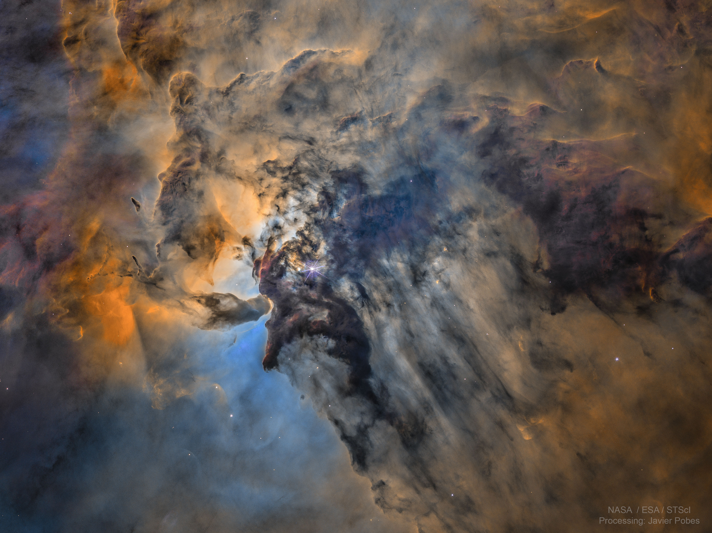

# NASA Astronomy Picture of the Day (APOD) Wallpaper Script

Bu Python programı, NASA'nın Astronomy Picture of the Day (APOD) API'sini kullanarak günlük görselleri alır ve kullanıcının isteğine bağlı olarak masaüstü arkaplanı olarak ayarlar.

## Gereksinimler

- Python 3.x  (İndirmek için [buraya :D](https://www.python.org/downloads/macos/) tıklayabilirsiniz)
- nasapy kütüphanesi

        pip install nasapy
- PIL (Python Imaging Library) kütüphanesi (pip install pillow)

        pip install pillow
- gTTS (Google Text-to-Speech) kütüphanesi (pip install gTTS)

        pip install gTTS
- appscript kütüphanesi (pip install appscript)

        pip install appscript

## Kullanım

- NASA API erişim anahtarınızı belirtin:
  Programın çalışması için bir NASA API erişim anahtarına ihtiyacınız vardır. Anahtarınızı API_KEY değişkenine atayarak programın sağlayın. Eğer bir API anahtarınız yoksa, [NASA API](https://api.nasa.gov/) sayfasından ücretsiz bir anahtar alabilirsiniz.
  
- Programı çalıştırın:
  Programı çalıştırmak için Python yorumlayıcısı gereklidir. Terminali veya komut istemcisini açın ve aşağıdaki komutu girin:

      python program.py
program.py, programın dosya adıdır. Kendi program dosyanızın adını kullanarak komutu çalıştırın.

- Günlük görseli görüntüleyin:
  Program, güncel tarih için NASA APOD API'sini kullanarak o günün görselini alır. Eğer görsel bir resimse, yüksek çözünürlüklü (HD) bir sürümü varsa indirir ve görüntüler. Görsel, programın çalıştığı dizinde APOD adında bir klasöre kaydedilir ve görüntülenir.

- Masaüstü arkaplanı olarak ayarlayın:
  Kullanıcıya, görseli beğenip beğenmediği sorulur. Kullanıcının seçimine göre, resim masaüstü arkaplanı olarak ayarlanır. Bu işlem için, Mac kullanıcıları `appscript` kütüphanesini kullanarak masaüstü arkaplanını değiştirebilirler. Windows veya Linux kullanıcıları, kendi işletim sistemlerine özel yöntemleri kullanarak masaüstü arkaplanını değiştirebilirler.

## Önemli Notlar

- Görsel bir video ise (Nasa bazen böyle şeyler yapabiliyor :D), program otomatik olarak sona erer.
- Programın çalışabilmesi için internet bağlantısı gereklidir.
- Görüntüler, programın çalıştığı dizinde `APOD` adında bir klasöre kaydedilir.

---

Bu program, NASA'nın APOD API'sini kullanarak günlük görselleri almayı ve masaüstü arkaplanı olarak ayarlamayı sağlar. Programı çalıştırarak her gün farklı bir görseli keşfedebilir ve masaüstünüzü güncel ve etkileyici görsellerle süsleyebilirsiniz.

Katkıda bulunmak veya programı geliştirmek isterseniz, lütfen bir istek veya öneri gönderin.

Umarım bu dökümantasyon size yardımcı olur! İyi günler :)
